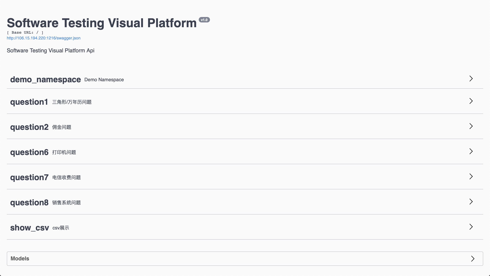
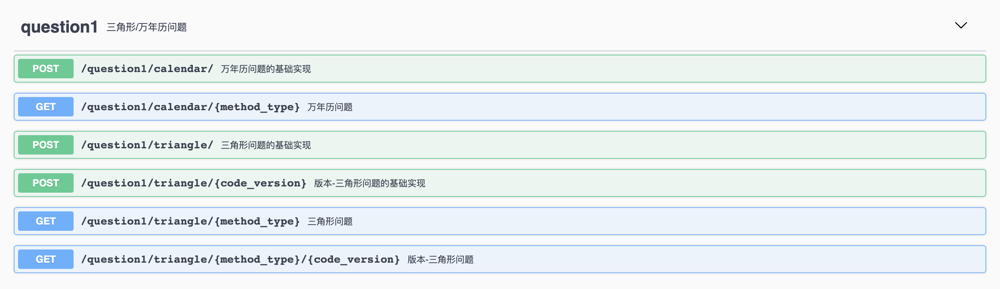
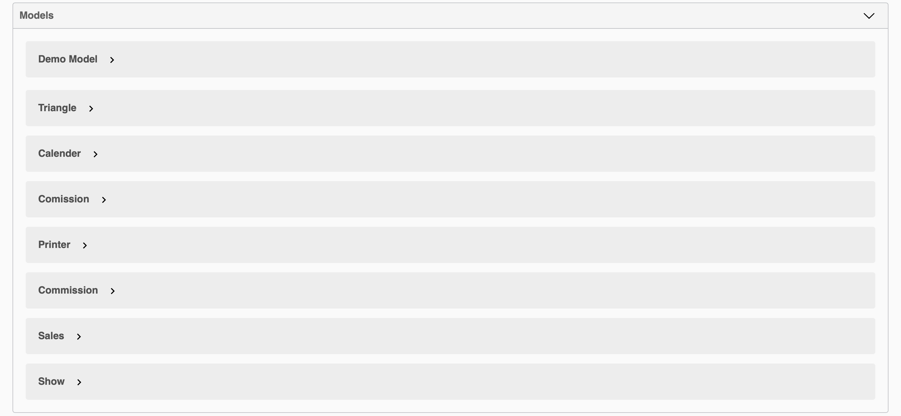
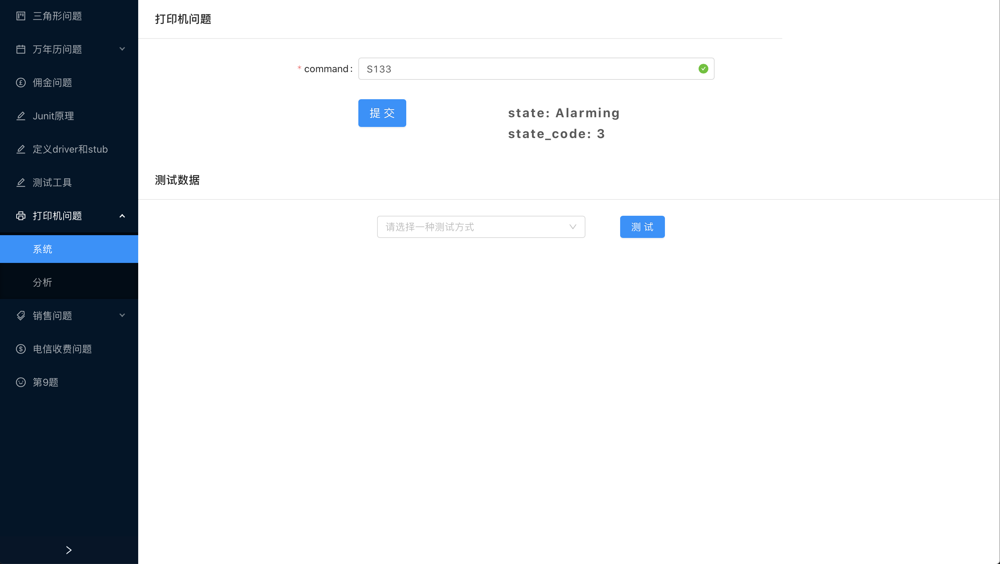
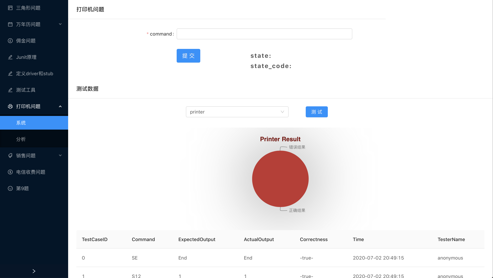
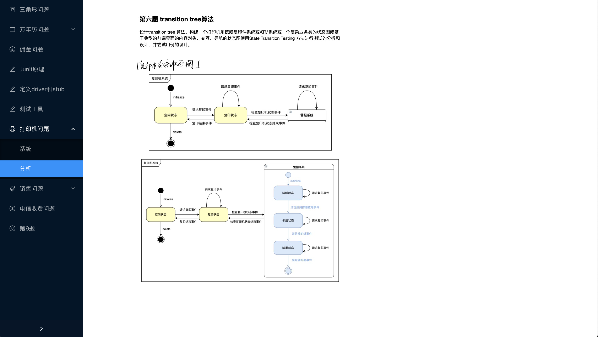

# Software Testing Visual Platform


## 目录

[部署地址](#部署地址)

[运行环境](#运行环境)

[目录结构](#目录结构)

[项目截图](#项目截图)

## 部署地址

前端：http://47.100.95.43:8083

后端：http://106.15.194.220:1216

## 运行环境

- python版本要求: python 3.7
- python库要求: requirements.txt

```shell script
pip install -r requirements.txt 
```

## 目录结构

```text
.
├── app                     # 项目主目录
│   ├── app.py              # app入口文件
│   ├── common				# 公共工具集
│   │   └── commonUtil.py	# Dataframe的读取及更新
│   ├── controller          # 控制层
│   │   ├── __init__.py     # api命名空间注册
│   │   ├── questionX.py	# questionX API接口实现
│   │   └── demo.py
│   ├── csv                 # csv
│   │   ├── qX				# 测试用例csv目录
│   │   └── index.py        # csv索引
│   ├── model               # 实体层
│   │   ├── questionX.py	# questionX 参数读取模型
│   │   └── demo.py
│   └── service             # 业务逻辑层
│       ├── questionX.py	# questionX 的业务实现
│       └── demo.py
└── start.py                # 项目启动文件
```

## 项目截图

### 后端







### 前端

1. 参数测试



2. 预定义用例测试



3. 问题分析



